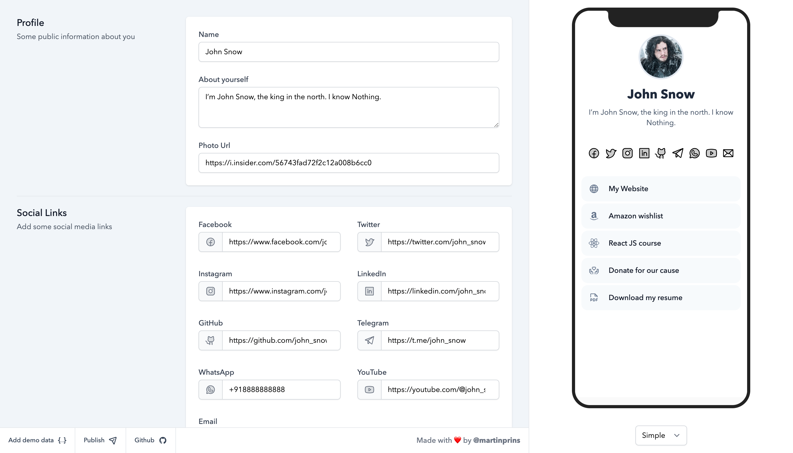

# Onelink

> **Note**
> This project is a SvelteKit implementation of [Nuxt Onelink](https://github.com/fayazara/onelink) by [**@fayazara**](https://github.com/fayazara).

Onelink is an experimental link-in-bio tool, where the data lives in the URL.



## How it works

The data is converted to a base 64 string which we onelink uses as a query parameter. I have tried to reduce the json keys to be as small as possible

## Setup locally

Make sure to install the dependencies:

```bash
# yarn
yarn install

# npm
npm install

# pnpm
pnpm install --shamefully-hoist
```

## Development Server

Start the development server on http://localhost:3000

```bash
npm run dev -- --open
```

## Production

Build the application for production:

```bash
npm run build
```

Locally preview production build:

```bash
npm run preview
```
